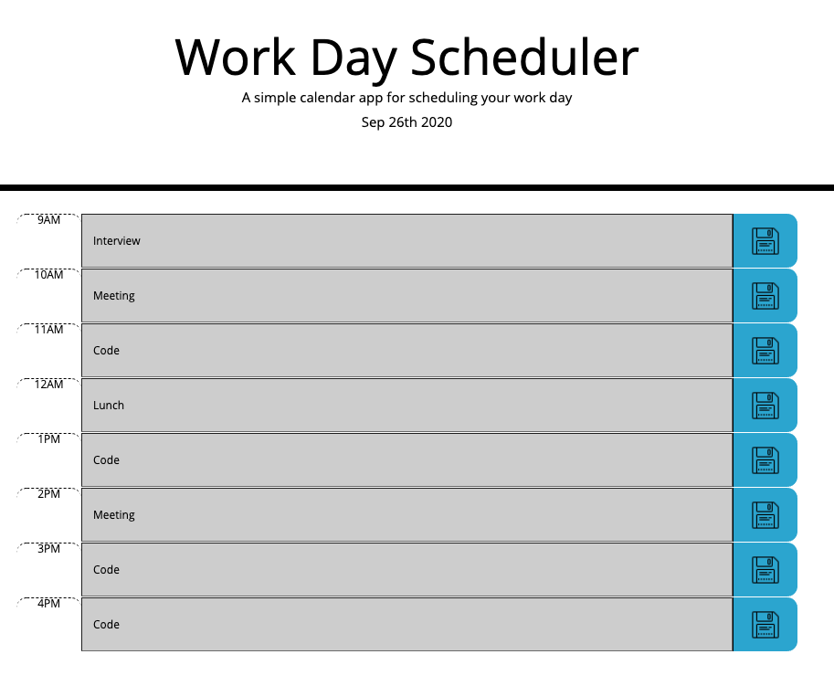

# Work Day Scheduler

A calendar app that helps you organize your day

## Description

[Deployment](https://anusontarangkul.github.io/work-day-scheduler/)

This app helps you organize all of your events during the work day. During the current hour, the calendar highlights to green. For past events, the calendar highlights to gray. For future events, the calendar highlights to green.

## Technologies

- HTML
- CSS
- CSS Bootstrap
- Javascript
- jQuery
- Moment.js

## Installation

No installation necessary.

## Usage

You type in the task you have to do at each hour. You press the save button on the right of the row to save the information to your local server.

## Credits

David Anusontarangkul
[Github](https://github.com/anusontarangkul)
[LinkedIn](https://www.linkedin.com/in/anusontarangkul/)

This project was apart of UC Berkeley Extension Full Stack Flex Program.

## License

Copyright <2020> <David Anusontarangkul>

Permission is hereby granted, free of charge, to any person obtaining a copy of this software and associated documentation files (the "Software"), to deal in the Software without restriction, including without limitation the rights to use, copy, modify, merge, publish, distribute, sublicense, and/or sell copies of the Software, and to permit persons to whom the Software is furnished to do so, subject to the following conditions:

The above copyright notice and this permission notice shall be included in all copies or substantial portions of the Software.

THE SOFTWARE IS PROVIDED "AS IS", WITHOUT WARRANTY OF ANY KIND, EXPRESS OR IMPLIED, INCLUDING BUT NOT LIMITED TO THE WARRANTIES OF MERCHANTABILITY, FITNESS FOR A PARTICULAR PURPOSE AND NONINFRINGEMENT. IN NO EVENT SHALL THE AUTHORS OR COPYRIGHT HOLDERS BE LIABLE FOR ANY CLAIM, DAMAGES OR OTHER LIABILITY, WHETHER IN AN ACTION OF CONTRACT, TORT OR OTHERWISE, ARISING FROM, OUT OF OR IN CONNECTION WITH THE SOFTWARE OR THE USE OR OTHER DEALINGS IN THE SOFTWARE.
